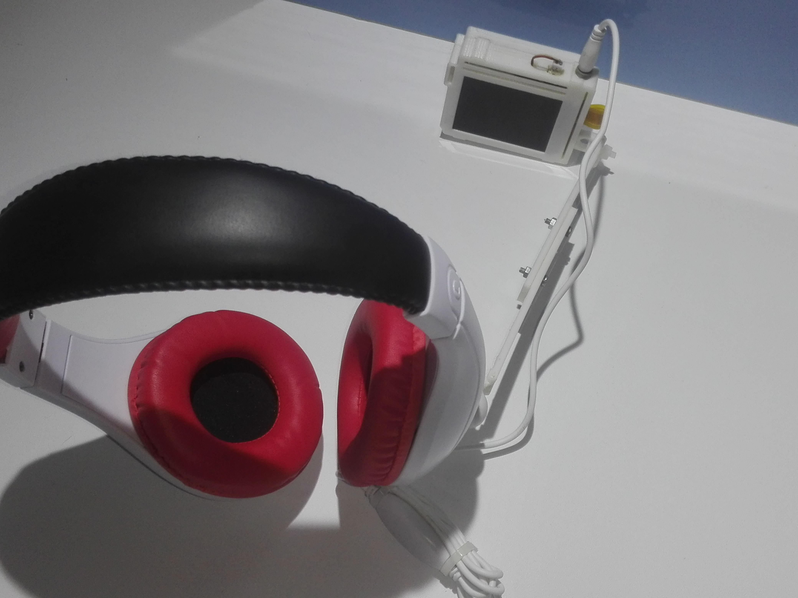

# Smart_Tour_Guide
A graduation project that make the tourists feel a more enjoyable and beneficial experience when entering archaeological museums

## Table of Contents

#### [maixDuino](maixDuino)
 - STG glasses hardware project
 
#### [STG_servers ](STG_servers )
 - STG glasses servers
 
#### [pharaohs_face_recognition](pharaohs_face_recognition)
 - pharaohs face recognition project

#### [pharaonic_languages_translation](pharaonic_languages_translation)
 - pharaonic languages translation project
 
#### [Voice_assistant](Voice_assistant)
 - Voice assistant project
 
 #### [landmarks_recognition](landmarks_recognition)
 - landmarks recognition project
 
 #### [Sign_language_translation](Sign_language_translation)
 - Sign_language_translation project
