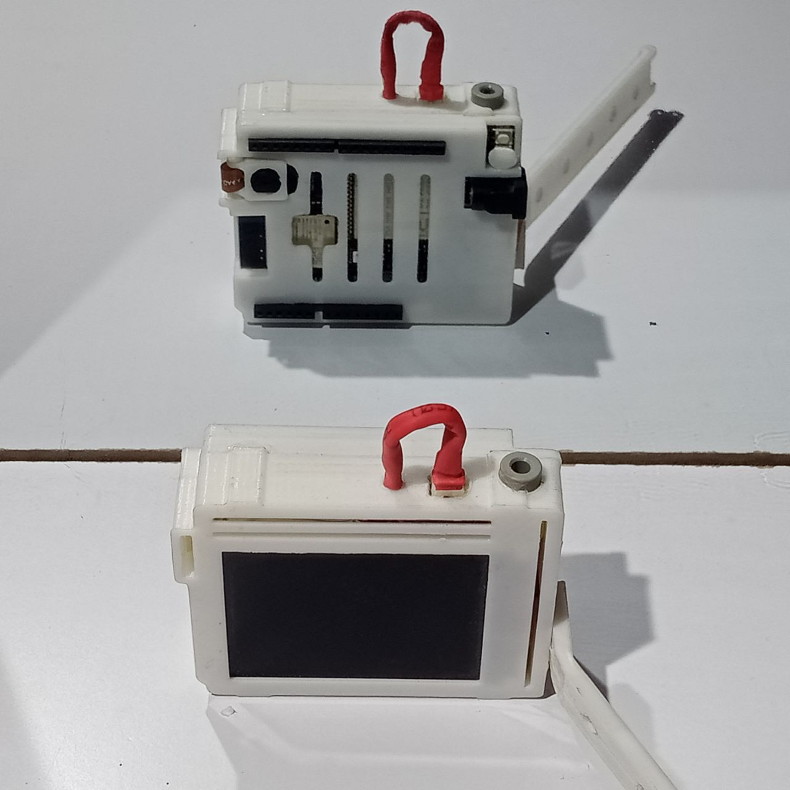
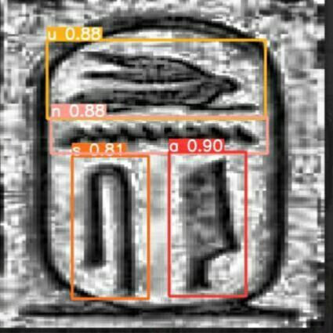
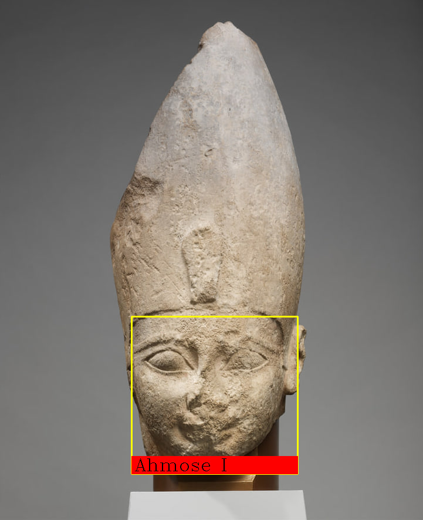
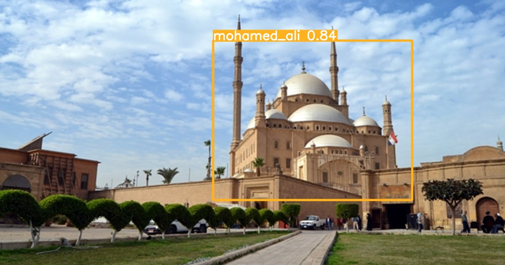
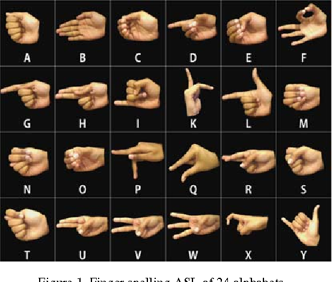
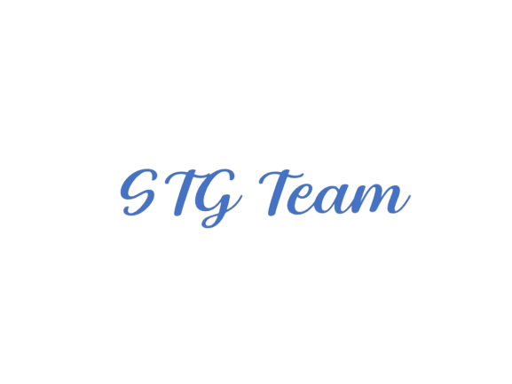

# Smart_Tour_Guide
A graduation project that make the tourists feel a more enjoyable and beneficial experience when entering archaeological museums

## Overview

### Projects
<table style="width:100%">
 <tr>
    <th>
     

           
            P1: STG glasses
            <a href="./P1__STG_glasses/maixDuino/main.py" name="p1_code">(code)</a>
     

    </th>
    <th>
     

           
            P2: Pharaonic languages translation
            <a href="./P2__pharaonic_languages_translation" name="p2_code">(code)</a>
     

    </th>
     <th>
      

         
          P3: Pharaohs face recognition
          <a href="./P3__pharaohs_face_recognition/main.ipynb" name="p3_code">(code)</a>
      

 </tr>
 <tr>
    <th>
      

           
            P4: Landmarks recognition
            <a href="./P4__landmarks_recognition" name="p1_code">(code)</a>
      

    </th>
     <th>
      

        
         P5: Voice assistant
         <a href="./P5__Voice_assistant/main.py" name="p2_code">(code)</a>
     

    </th>
     <th>
      

         
          P6: Sign language translation
          <a href="./P6__Sign_language_translation" name="p3_code">(code)</a>
      

 </tr>
</table>

 ---
## Table of Contents

#### [P1 - STG glasses](./P1__STG_glasses)
 - **Summary:** STG glasses (hardware project) Which provides some services to tourists to make the tourism experience more enjoyable.
 - **Keywords:** MaixDuino, MicroPython, Computer Vision, Speech Recognition, Network, Deep Learning
 
#### [P2 - Pharaonic languages translation](./P2__pharaonic_languages_translation)
 - **Summary:** ...
 - **Keywords:** ...
 
#### [P3 - Pharaohs face recognition](./P3__pharaohs_face_recognition)
 - **Summary:** ...
 - **Keywords:** ...
  
#### [P4 - Landmarks recognition](./P4__landmarks_recognition)
 - **Summary:** ...
 - **Keywords:** ...
  
#### [P5 - Voice assistant](./P5__Voice_assistant)
 - **Summary:** ...
 - **Keywords:** ...
  
#### [P6 - Sign language translation](./P6__Sign_language_translation)
 - **Summary:** ...
 - **Keywords:** ...
 
 
 

  

