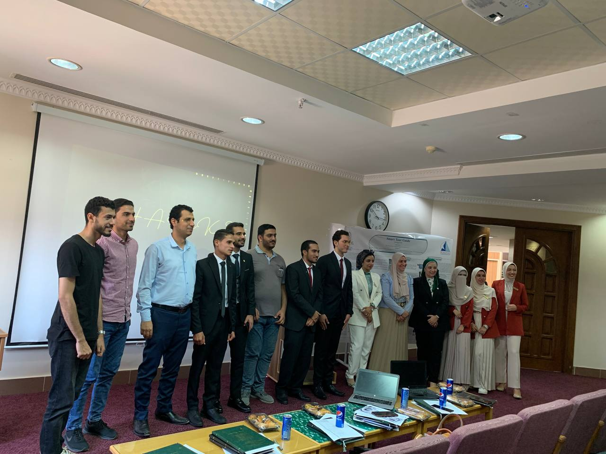

# Smart_Tour_Guide

Today, tourism comes at the forefront of the sources of national income, and what serves tourism is to provide an exceptional experience for the tourist, and in response to this matter, this project was, which is a smart glasses equipped with a voice assistant capable of translating the hieroglyphic language, and just as the wonderful discovery of Champollion unveiled the secrets of the ancient Egyptian civilization, this The project will offer the tourist a translation of texts written in hieroglyphics without effort, in addition to the feature of identifying historical figures and presenting information about them. It is also equipped with the ability to identify tourist attractions in addition to translation between natural languages, which provides the tourist with what he needs without the need for a tour guide, which makes it wonderful for him and increases the demand for tourism.

Smart tour guide (STG) is a technology that combines augmented reality with tourism. It is a wearable device that can provide visitors with information about the places they are visiting, making their experience more immersive and informative. The smart glasses tour guide works by overlaying digital information onto the physical world, enhancing the visitor's view of their surroundings.

## Overview

### Projects
<table style="width:100%">
 <tr>
    <th>
     

           
            P1: STG glasses
            <a href="./P1__STG_glasses/maixDuino/main.py" name="p1_code">(code)</a>
     

    </th>
    <th>
     

           
            P2: Pharaonic languages translation
            <a href="./P2__pharaonic_languages_translation" name="p2_code">(code)</a>
     

    </th>
     <th>
      

         
          P3: Pharaohs face recognition
          <a href="./P3__pharaohs_face_recognition/statues_face_recognition.ipynb" name="p3_code">(code)</a>
      

 </tr>
 <tr>
    <th>
      

           
            P4: Landmarks recognition
            <a href="./P4__landmarks_recognition" name="p1_code">(code)</a>
      

    </th>
     <th>
      

        
         P5: Voice assistant
         <a href="./P5__Voice_assistant/main.py" name="p2_code">(code)</a>
     

    </th>
     <th>
      

         
          P6: Sign language translation
          <a href="./P6__Sign_language_translation" name="p3_code">(code)</a>
      

 </tr>
</table>

 ---
## Table of Contents

#### [P1 - STG glasses](./P1__STG_glasses)
 - **Summary:** STG glasses (hardware project) Which provides some services to tourists to make the tourism experience more enjoyable.
 - **Keywords:** MaixDuino, MicroPython, Computer Vision, Speech Recognition, Network, Deep Learning
 
#### [P2 - Pharaonic languages translation](./P2__pharaonic_languages_translation)
 - **Summary:** This feature helps the tourist to understand the ancient Egyptian texts in a smooth manner
 - **Keywords:** hieroglyphic, YOLO, arrangement algorithm, modification algorithm
 
#### [P3 - Pharaohs face recognition](./P3__pharaohs_face_recognition)
 - **Summary:** This service helps tourists to identify the king or queen, then tourists can know about them and their achievements.
 - **Keywords:** OpenCV and face_recognition, YOLO
  
#### [P4 - Landmarks recognition](./P4__landmarks_recognition)
 - **Summary:** Landmark Detection and Localization function that Apply the trained model to new images to detect and localize the landmarks.
 - **Keywords:** YOLO, non-maximum suppression
  
#### [P5 - Voice assistant](./P5__Voice_assistant)
 - **Summary:** The user will enter any question he wants to know the answer to, whether about kings, museums, etc. It is also equipped with a language translation feature, so it can translate from one language to another.

 - **Keywords:** gtts , openweather API , playsound , speech_recognition , googletrans , NLP , TTS, STT 
  
#### [P6 - Sign language translation](./P6__Sign_language_translation)
 - **Summary:** In sign language, each hand sign refers to a certain character. And the collection of signs can construct a certain word
 - **Keywords:** MediaPipe, classification
 
---

 

  

 
 

  

